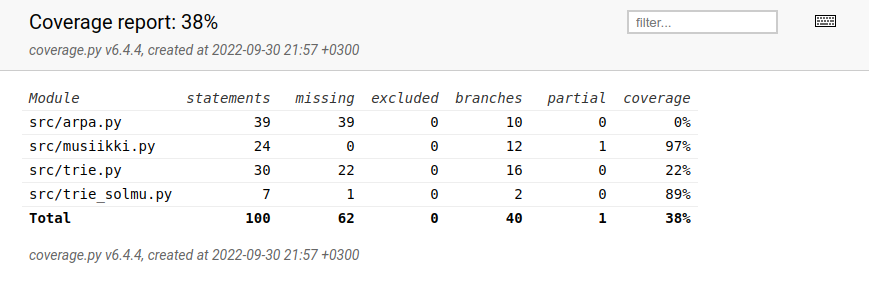

# Testausdokumentti

## Testikattavuusraportti

Täytyy jatkaa testien kirjoittamista ensi viikolla.

## Komennot

* coverage run --branch -m pytest src (testikattavuuden keräys)
* coverage report -m (testikattavuuden raportti komentoriville)
* coverage html (testikattavuuden raportti html-tiedostona)
