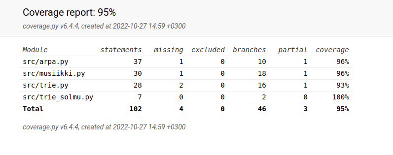

# Testausdokumentti

## Testikattavuusraportti

Trielle en onnistunut tehdä testiä. Testikattavuusraportissa näyttää kuin trietäkin olisi testattu, koska
onnistun sinne lisäämään solmuja. Sain ulos vain olion. Sen sijaan arpaluokkaa ja musiikkiluokkaa
on testattu kattavasti: luotu musiikkikappale on toivotunmittainen, on muutettu
nuottikirjainlistaa lukuosajonoiksi, ja nuottilukuja kirjainnuoteiksi.

## Komennot

Testauksen komennot on kerrottu [käyttöohjeissa](https://github.com/karhelmi/tiralabra/blob/master/dokumentaatio/kayttoohje.md).
Testit voidaan toistaa kuinka monta kertaa tahansa, ja tulokset ovat samat, koska olen antanut
lähtötiedot.
