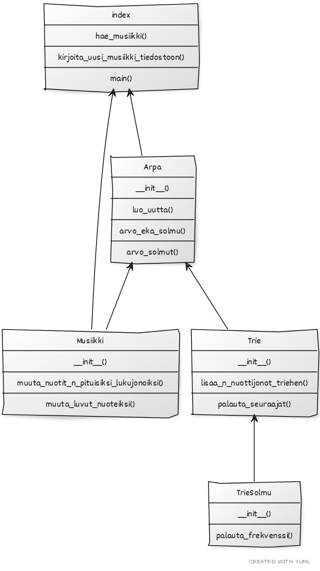

# Toteutusdokumentti

## Ohjelman yleisrakenne

Ohjelmassa on neljä luokkaa:
* trie
* trie-solmu
* musiikki
* arpa

Alla olevassa kuvassa on esitetty ohjelman rakenne luokkakaaviona mukaan lukien luokkien metodit.

## Aika- ja tilavaativuus

Algoritmi, joka lisää nuottijonot triehen määrittää aikavaativuuden. Aikavaativuus on n-pituisten
nuottijonojen määrä kerrottuna yhden nuottijonon nuottien määrällä. Aikavaativuus on täten noin
O('nuottijonojen_lukumäärä'*n). Jos 'nuottijonojen_lukumäärä'=m, niin aikavaativuus on O(mn).

Tilavaativuutta en ole arvioinut.

## Suorituskyky- ja O-analyysivertailu

Tätä ei ole tässä työssä arvioitu.

## Työn mahdolliset puutteet ja parannusehdotukset

Ohjelmaa voi parantaa ainakin seuraavasti:

* Jos ohjelma osaisi soittaa musiikin automaattisesti internetistä löytyvällä soittimella, 
niin se lisäisi käyttömukavuutta.
* Käyttöliittymää voisi parantaa. Nyt abc-musiikki pitää kopioida ohjelman tiedostoon ja uusi
musiikki täytyy kopioida ohjelman tiedosta. Myös uuden kappaleen pituuden ja nuottiosajonon pituuden
voisi määrittää helpommin kuin suoraan koodiin.
* Testit voisivat olla kattavammat.
* Voisi tutkia, onko aikavaativuutta mahdollisuus parantaa.

## Lähteet
* [Yuml-työkalu](https://www.yuml.me)
